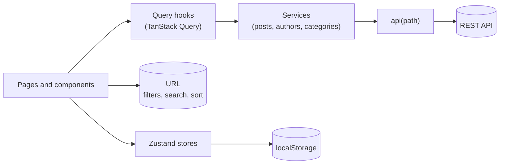

<h1 align="center">DWS Blog</h1>

<p align="center">
  A mobile-first blog built for the <strong>Dentsu World Services</strong> front end challenge.<br />
  React 19 · TypeScript · Vite · SCSS (BEM, no UI libraries) · TanStack Query · Zustand
</p>

<p align="center">
  
  
  
  
</p>

---

## Quick start

```bash
git clone https://github.com/matheuspsb/DWS.git
cd DWS
npm start
```

That is the only command you need. The project ships with a setup script, so there is no `npm install` step, no `.env` file and nothing else to configure. On every run it:

1. checks that your Node.js version is supported (**22.12 or newer**);
2. installs the dependencies when they are missing or outdated;
3. generates the design tokens from `tokens/*.json`;
4. starts the dev server.

The app is served at http://localhost:5173 (Vite picks the next free port if it is taken). The same setup runs before `build`, `test`, `lint` and `typecheck`, so every script works on a fresh clone.

## What is in the app

| View            | Route         | What it does                                                                                        |
| --------------- | ------------- | --------------------------------------------------------------------------------------------------- |
| **Post list**   | `/`           | All posts with category and author filters, sort order and search. Loading, error and empty states. |
| **Post detail** | `/posts/:id`  | Cover, byline, article body and a **Latest articles** section built from your reading history.      |
| **Not found**   | anything else | A friendly 404 with a way back to the posts.                                                        |

Highlights: pixel-checked against the design for mobile and desktop, skeleton loaders sized like the real content (no layout shift), keyboard and screen reader friendly markup, and a filter state you can share by copying the URL.

## Decisions worth discussing

### Search bar

- **Two presentations, one component.** From 768px up the field is inline in the header. Below that only a round search button is shown; it opens a **dropdown panel** at the top of the screen. The panel grows with the recent searches but never takes the whole screen, so the page behind stays visible while you type.
- **Search while typing, with a debounce.** Every keystroke updates the field, but the search itself runs after a 300 ms pause (`useDebouncedCallback`). The timer is started from the event handler, never from an effect watching the value. Pressing **Enter**, tapping the search button or picking a recent search skips the wait and cancels the pending call.
- **No history spam.** Typing updates the URL with `replace`, so the browser's Back button does not walk through every term.
- **Recent searches are intentional.** A search is saved when you press Enter, pick a suggestion or close the panel with a search typed in. Letters that were only passed through while typing are never saved. The list keeps the 8 latest, without repeating (case-insensitive).
- **Logic out of the markup.** `SearchBar` only wires hooks and renders. The behaviour lives in `useSearchBar` (next to the component) and the native `<dialog>` handling in the reusable `useModalDialog`.

### "Latest articles" only appears after you have read other posts

The section on the post page is a **reading history**, as in the design brief, not a list of the newest posts:

- Every time a post is opened its id is saved in a Zustand store, persisted in `localStorage` (`dws.viewed-posts`).
- The section shows the **last 3 posts you opened, most recent first, leaving out the one you are reading**.
- On a first visit (or after clearing the browser storage) there is nothing to show, so the section is **hidden** instead of rendering an empty heading.
- Only ids are stored. The post data comes from the cached post list, so it is never stale.

To see it: open two or three posts from the list, then open another one.

### Where each kind of state lives

| Kind of state                            | Where                                       | Why                                                                      |
| ---------------------------------------- | ------------------------------------------- | ------------------------------------------------------------------------ |
| Server data (posts, authors, categories) | **TanStack Query**                          | Caching, deduplication, request cancellation, loading and error states.  |
| Filters, search text and sort order      | **The URL** (`?category=&author=&q=&sort=`) | Shareable links, working Back button, survives a refresh.                |
| Recent searches and viewed posts         | **Zustand** + `persist`                     | Shared by distant components, not worth a URL, should survive a refresh. |
| Open/closed menus, filter panel draft    | Local `useState`                            | Used by one component only.                                              |

Zustand was chosen over Context/Redux for its tiny API, no provider and selector-based subscriptions. The filter panel keeps a local draft until **Apply filters** is pressed; the dropdowns on small screens apply right away, and both read the same URL state.

### Working around the API

- The API **ignores query parameters** (no filtering, search or pagination), so filtering, searching and sorting happen on the client in `src/utils/postFilters.ts`, a pure and tested module.
- Every post has the **same `createdAt`**, so "Oldest first" is the exact reverse of "Newest first". Otherwise the sort button would look broken.
- The API is rate limited to 100 requests per minute, hence the one-minute `staleTime` in the query client.

### Design interpretations

The design does not cover everything, so these are the choices made:

- **Tablet (768 to 1023px)** has no layout in the design. It reuses the mobile grid, with cards spanning 2 of 4 columns.
- **Page title:** the desktop list shows "DWS blog". The design has no title on mobile, so there it stays in the HTML for screen readers only.
- **"Last articles" vs "Latest articles":** the design uses the first wording on mobile and the second on desktop. Both are rendered, one per breakpoint; the screen reader name is always "Latest articles".
- **Colors:** where the text of the spec and the drawing disagreed, the drawing won (headings are `primary-dark`). The background glows were measured from the design and rebuilt from palette colors with opacity.

## Architecture



```
tokens/         Design tokens in JSON (source of truth)
scripts/        setup.mjs: Node check, dependency install, token generation
src/
  api/          api<T>() client, API address, response types, QueryClient setup
  services/     One factory per resource: postsService(), authorsService(), categoriesService()
  hooks/        Reusable hooks (Query hooks, URL filters, useModalDialog, useDismiss...)
  stores/       Zustand stores (recent searches, viewed posts)
  components/   Atomic Design: atoms, molecules, organisms, templates
  pages/        Route-level views (PostList, PostDetail, NotFound)
  styles/       Design system: tokens, functions and mixins, base styles
  utils/        Pure helpers (filters, excerpt, formatting...)
  test/         Test setup, fixtures and helpers
```

- **Services** are plain functions typed in payload and return: `const { getPosts } = postsService()`. Components never call them directly; they go through the Query hooks.
- **Atomic Design** with one folder per component (`Component.tsx`, `.scss`, `.test.tsx`). Imports only go down the chain: atoms know nothing about molecules, molecules compose atoms, organisms own state and behaviour.
- **Design system:** colors, spacing, radii, shadows and type styles are JSON tokens (`palette -> semantic -> component`), compiled by Style Dictionary into CSS custom properties and a Sass map. Components only use semantic tokens through `ds.color()`, `ds.space()` and friends, and unknown token names fail the build.
- **Layout grid:** 4 columns, 16px margin and gutter on mobile; 12 columns, 56px margin and 24px gutter from 1024px, capped at 1440px.
- **Accessibility:** semantic elements, native `<dialog>` for the mobile search (focus trap, Escape and focus return for free), labelled landmarks, `aria-expanded` and `aria-controls` on dropdowns, visible focus rings, text alternatives for images, 4.5:1 text contrast.

## Scripts

| Script               | Description                                                    |
| -------------------- | -------------------------------------------------------------- |
| `npm start`          | Dev server (runs the setup first)                              |
| `npm run build`      | Type check and production build                                |
| `npm run preview`    | Serve the production build locally                             |
| `npm test`           | Run all tests once                                             |
| `npm run test:watch` | Tests in watch mode                                            |
| `npm run typecheck`  | TypeScript only                                                |
| `npm run lint`       | Lint with oxlint                                               |
| `npm run format`     | Format with Prettier (`npm run format:check` only verifies)    |
| `npm run tokens`     | Regenerate the SCSS tokens (runs automatically before `start`) |

## Testing

Tests use **Vitest** and **React Testing Library**, querying by role and accessible name and driving the UI with `user-event`. They cover behaviour rather than markup: keyboard use, controlled and uncontrolled components, debounce timing (fake timers), URL state, stores, hooks, loading and error states. Network calls are mocked at the single `api` function.

## Good to know

- **Duplicated requests in dev.** In development React's `StrictMode` mounts every component twice, so the Network tab shows a request that is `canceled` followed by the real one. The cancellation is the query client aborting the first mount's request. It does not happen in the production build.
- **Saved data.** The search history and reading history live in `localStorage` under `dws.recent-searches` and `dws.viewed-posts`. Clearing the site data resets both.
- **Another backend.** The API address is a default in `src/api/config.ts`. To point somewhere else, create a git-ignored `.env` with `VITE_API_URL=https://your-api.example.com`.
